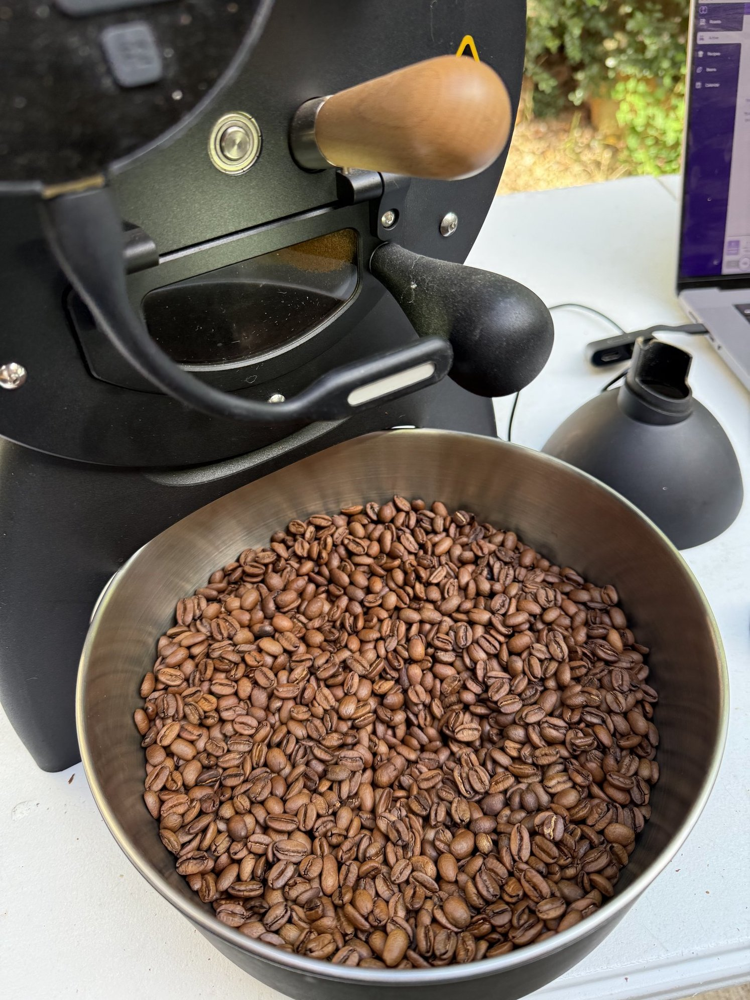

Over the past year, my journey as a roaster has taken a whole new dimension—thanks to the breathtaking quality of Guatemalan coffees and the incredible power of my **Aillio Bullet R1** roaster. As a **Level 1 and Level 2 Certified Roaster by the Sustainable Coffee Institute (SCI)**, I’ve had the privilege to explore and truly understand the intricacies of high-end coffees, especially from my home country.

## ☕ The Beauty of Guatemalan Naturals

This past year, I’ve been lucky enough to roast and enjoy **two exceptional Geishas** from Guatemala:
- One processed through **carbonic maceration**
- The other a **classic natural**

Both coffees scored incredibly well:
- **Carbonic Maceration Geisha – 90 points**
- **Natural Geisha – 91 points**

These coffees went to **auction at incredibly high prices**, and it’s no surprise. The **complexity of the natural Geisha** blew me away with its bright florals, juicy berries, and a silky mouthfeel that lingers like a fine dessert wine. The **carbonic maceration Geisha** was an entirely different ride—elegant structure, a vibrant acidity reminiscent of ripe stone fruits, and a wild tropical twist that made every cup a small celebration.

## 🔥 Roasting with the Aillio Bullet

The **Aillio Bullet R1** changed my roasting game in the best way possible. Precision, repeatability, and control allowed me to **dial in roast curves** that truly brought out the best in these exquisite beans. It’s no exaggeration to say that this machine helped me **unlock flavor clarity** I couldn’t quite get with other setups before.

I’ve logged roast after roast, learning how **heat application, charge temp, and development time** all shape the final cup—and the Bullet made that process intuitive and powerful.

## 🚀 Looking Ahead: 2025 Harvest

With such an amazing experience behind me, I’m already **eagerly tracking the 2025 Guatemalan coffee harvest**. The bar has been set incredibly high, but I’m confident there’s even more magic on the horizon. I’m hoping to get my hands on new natural and experimental-process coffees as early as possible to keep pushing my craft and sharing the joy of truly exceptional cups.

---

📸 *More roasting shots and cupping notes coming soon...*

Stay tuned as I continue to roast, cup, and share the amazing world of Guatemalan coffee—one small batch at a time.
